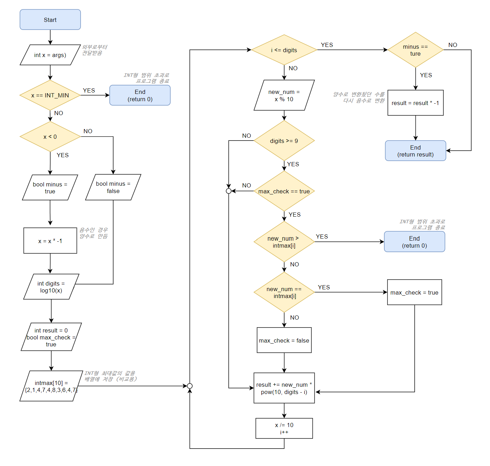
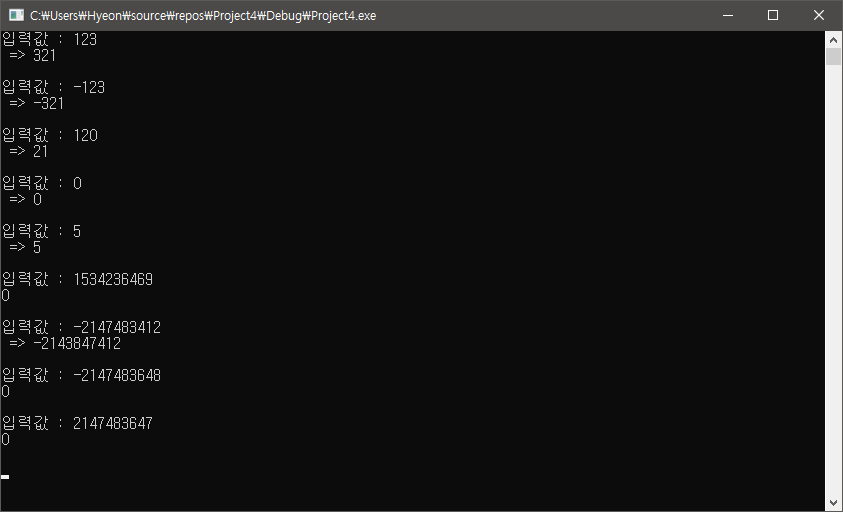
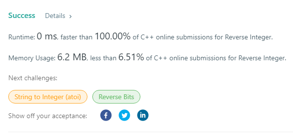

# 7. Reverse Integer

int형(32비트) 정수가 입력으로 주어졌을 때, 이 입력을 반대로 뒤집어서 반환하면 됩니다.

뒤집은 숫자가 int형을 초과할 때는 숫자 0을 반환합니다.

또한 해당 시스템에서는 64비트 int형(long long)은 사용할 수 없는 것으로 가정합니다.

> https://leetcode.com/problems/reverse-integer/ 
>
> Given a signed 32-bit integer x, return x with its digits reversed. If reversing x causes the value to go outside the signed 32-bit integer range [-231, 231 - 1], then return 0.
>
> Assume the environment does not allow you to store 64-bit integers (signed or unsigned).

<br/>

## 입출력 예제

```
Example 1:
Input: x = 123
Output: 321
```

```
Example 2:
Input: x = -123
Output: -321
```

```
Example 3:
Input: x = 120
Output: 21
```

```
Example 4:
Input: x = 0
Output: 0
```

범위: -2^31^ <= x <= 2^31^ - 1  

<br/>

## 코딩 전 생각해볼만한 사항

* 숫자를 뒤집는 방법은, 숫자를 하나 뽑은 뒤  원하는 자리로 가도록 10, 100, 1000, ... 을 곱해주면 됩니다.
* 32비트 int형의 범위는 **-2,147,483,648 ~ 2,147,483,647** 입니다. 

- 양수와 음수를 구분지어 처리하기 힘들다면, 모든 입력을 **양수(절대값)로 만들어서 처리**하면 됩니다.

- 1000000009을 뒤집으면 90억이되어 예외조건(32비트 int형 보다 크기가 큼)에 해당됩니다.
- 위와 같이 INT형을 초과한 수는 오버플로우를 일으키므로 무작정 값을 대입하면 안됩니다. (매 순간 검사가 필요함)

  <br/>

## 플로우차트 (FlowChart)



<br/>

## 핵심코드

1. **숫자뒤집기**  
   아래 코드를 베이스로 숫자 뒤집기를 구현 할 수 있습니다.

   ```cpp
   int x = 1234;
   int result = 0;
   
   for(int i=0; x != 0; i++) {
     result += (x % 10) * pow(10,3-i); //숫자 하나를 뽑아서, 10에 n승을 곱합니다.
     x = x / 10;
   }
   std::cout << result; //출력 : 4321
   ```

   원래 숫자의 단위가 몇인지는 log10 함수를 통해 확인 할 수 있습니다.

   >  int digits = (int) log10(x);

   

2. **음수/양수 구분없이 처리하기**  

   몇의 자리 숫자인지 알아내기 위해 log10 함수를 사용하는 경우, 양수의 경우 값을 구하는데 문제가 없습니다. 하지만 음수의 경우 문제가 생깁니다. 이를 해결하기위해 입력된 수를 확인하여 음수인 경우 우선 양수로 변환하여 처리한 뒤에 다시 음수로 만들어주는 스킬이 필요합니다.

   ```cpp
   //마이너스인지 확인해서 마이너스면 양수로 전환
   bool minus = false;
   if (x < 0) {
   	minus = true;
   	x *= -1;
   }
   
   //마이너스 숫자였던 경우 마이너스 붙여주기
   if (minus)
   	x *= -1;
   ```

   

3. **가장 작은 음수에 대한 예외처리**  

   위와 같이 음수를 양수로 바꾸는 경우 한가지 문제점이 있습니다. int형 변수의 범위는 다음과 같습니다. 

   >(32비트) int의 범위 : -2^31^ <= x <= 2^31^ - 1

    양수와 음수 모두 2^31^ 이라는 절대값을 보이는데, 자세히보시면 양수의 경우 절대값에서 **1** 만큼을 뺀것을 볼 수 있습니다. 즉, 가장작은 음수가 가장큰 양수보다 1만큼 더 큰 것입니다. 만약 가장작은 음수에 -1을 곱하여 양수로 만든다면 int형의 범위를 벗어나게 됩니다.
    따라서 해당 수에 대해서는 미리 예외처리를 해줘야합니다. 코드는 아래와 같습니다.

   ```cpp
   //INT_MIN(-2,147,483,648)인 경우 0을 반환.
   if (x == INT_MIN)
   	return 0;
   ```

   

4. **int형 범위안에 있는지 확인하기**  
   아래 코드는 숫자뒤집기를 작은 자릿수부터 순차적으로 실행하면서, 해당 수가 int형 범위안에 있는지 확인하는 코드입니다. 개념적인 특징은 다음과 같습니다.

   * 최초입력된 숫자가 10억보다 작은 경우 검사를 진행할 필요가 없다.
   * 뒤집힌 숫자가 INT_MAX의 해당 자릿수보다 작다면(미만) 검사를 더이상 진행할 필요가 없다.

   ```cpp
   //숫자 뒤집기 실행.
   int result = 0;
   bool max_check = true;
   int intmax[10] = { 2,1,4,7,4,8,3,6,4,7 };
   for (int i = 0; i <= digits; i++) {
       int new_num = x % 10;
   
       //x가 10억 단위인 경우, 진행시 문제가 되는지 확인 (int => 32bit)
       if (digits >= 9) {
       if (max_check) {
       if (new_num > intmax[i]) //현재숫자가 int형보다 크다면 0을 반환한다.
       return 0;
       else if (new_num == intmax[i]) //현재숫자가 int형과 같다면 다음 숫자를 계속 검사한다.
       max_check = true;
       else //현재숫자가 int형보다 작다면 이후 숫자들은 검사할 필요가 없다.
       max_check = false;
       }
   }
   
   result += new_num * (int)pow(10, digits - i);
   x /= 10;
   ```

   <br/>

## 실행 예시







<br/>

## 공식 솔루션코드 분석

아래 코드는 리트코드 사이트에서 공식적으로 제공하는 솔루션입니다. 20줄도 안되는 코드로 동일한 기능을 구현한 것을 볼 수 있습니다. 

```cpp
class Solution2 {
public:
	int reverse(int x) {
		int rev = 0;
		while (x != 0) {
			int pop = x % 10;
			x /= 10;
			if (rev > INT_MAX / 10 || (rev == INT_MAX / 10 && pop > 7)) return 0;
			if (rev < INT_MIN / 10 || (rev == INT_MIN / 10 && pop < -8)) return 0;
			rev = rev * 10 + pop;
		}
		return rev;
	}
};
```

### 숫자뒤집기 코드로 보는 차이

```cpp
int rev = 0;
while (x != 0) { //입력된 숫자를 10으로 계속나누다보면 언젠간 0이됩니다. 0이되면 연산을 마칩니다.
    int pop = x % 10; //가장작은 숫자 한개를 뽑습니다.
    x /= 10; //가장 오른쪽에 숫자를 뽑았으므로 해당 숫자를 제거합니다.
    rev = rev * 10 + pop; //기존결과값에 10을 곱하여 한칸씩 왼쪽으로 옮깁니다. 이후 새로생긴 가장오른쪽 공간에 새로 뽑은 숫자를 넣습니다.
}
```

가장 큰 특징은 숫자뒤집기를 하는 코드에서 나타납니다. 제 코드의 숫자뒤집기 진행은 '가장 작은 숫자를 뽑은 다음에 10에 n승을 곱하는 것'으로 이루어집니다.

> 예를 들어 1234라는 수가 있다면 아래 순서대로 진행하여 4321을 만들어냅니다.
>
> result = result + (4 * 1000)
>
> result = result + (3 * 100)
>
> result = result + (2 * 10)
>
> result = result + (1 * 1)

하지만 위 공식솔루션에 코드는 '가장 작은 숫자를 뽑은 다음에 결과변수에 넣은 후에 기존 결과값에 10을 곱하는 것'으로 이루어집니다.

> 예를 들어 1234라는 수가 있다면 아래 순서대로 진행하여 4321을 만들어냅니다.
>
> result = (result * 10) + 4
>
> result = (result * 10) + 3
>
> result = (result * 10) + 2
>
> result = (result * 10) + 1

이를 통해서 얻을 수 있는 상대적인 이득은 코드(메모리 및 실행속도를 포함한 전반적인)의 단순화에 있습니다. 제가 작성한 코드는 최초입력된 숫자가 몇의 자리까지 있는지 기억한 뒤, 이를 기반으로 연산들이 진행됩니다. 하지만 공식 솔루션코드 같은 경우 그럴 필요가 없으므로 상대적으로 유연하게 작동합니다.

### int형 범위검사 코드로 보는 차이

```cpp
if (rev > INT_MAX / 10 || (rev == INT_MAX / 10 && pop > 7)) return 0;
if (rev < INT_MIN / 10 || (rev == INT_MIN / 10 && pop < -8)) return 0;
```

공식 솔루션 코드는 위 2가지 조건문을 통하여 int형 범위안에 있는지 검사합니다. 해당 코드를 여러줄로 풀어내면 아래와 같습니다. 

```cpp
if (rev > INT_MAX / 10)
	return 0;
if (rev == INT_MAX / 10)
	if (pop > 7)
		return 0;
	
if (rev < INT_MIN / 10)
    return 0;
if (rev == INT_MIN / 10)
    if (pop < -8)
        return 0;
```

우선 공식솔루션의 경우 양수/음수를 모두 처리하므로, 각각의 경우에 대한  조건문을 따로 두어 처리한 것을 볼 수 있습니다. 양수를 검사하는 것만 예를 들면 아래와 같습니다.

1. 우선 rev(결과값) 변수는 매 루프마다 10배씩 커진다는 것을 기억해 둡시다.
2. rev값과 *INT_MAX / 10* 을 비교합니다. (즉, rev값이 1억이상이 되었을때가 비교 target)
   1) rev값이 INT_MAX / 10 보다 큰 경우 이후 어떤수가 나오든 범위초과이므로 0을 리턴
   2) rev값이 INT_MAX / 10 과 같은 경우 이후에 위치할 수를 확인한다.
   3) 이후 위치할 수(pop)가 7보다 큰 경우 INT형 범위초과이므로 0을 리턴


간단한 문제이기 때문에 제가 작성한 코드와 공식 솔루션코드의 전체적인 흐름은 유사하나, 코드의 길이와 복잡성은 매우 많은 차이를 보이고 있습니다. 따라서 두 코드는 유지보수와 협업의 관점에서 볼때 제가 작성한 코드는 상대적으로 큰 비용이 발생합니다. 확인하였듯이 생각보다 비용 차이가 크기 때문에, 로직 작성시 해당 부분을 항상 염두해두고 작성 해야 할 것 같습니다.

